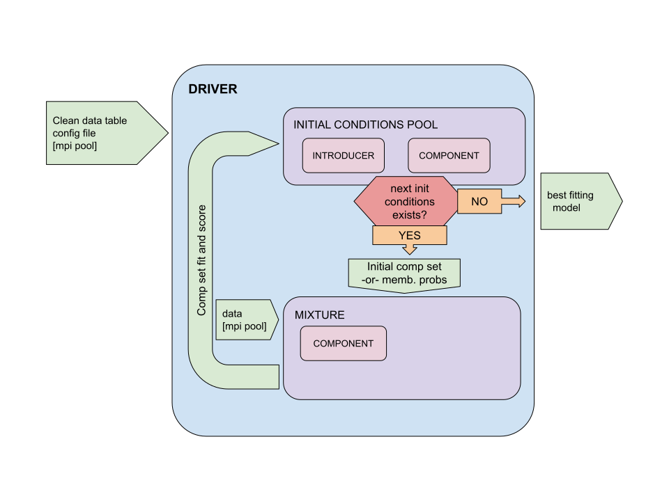

General Overview
================

Chronostar: The Next Generation
-------------------------------

The next generation of Chronostar prioritises simplicity, flexibility and extensibility. The default behaviour address the most simple scenario but the means of extending the capabilties for more complex scenarios is straight forward; by default Chronostar-TNG (will) provide abstract base classes which clearly dictate required interfaces as well as many different example reifications for the most basic scenarios. How one actually extends these example implementations to address complex scenarios is left to the user. ;)

The framework of Chronostar TNG consists of 5 classes. A :doc:`Driver <driverguide>`, a :doc:`Initial Conditions Pool <icpoolguide>`, an :doc:`Introducer <introducerguide>`, a :doc:`Mixture <mixtureguide>` and a :doc:`Component <componentguide>`.

Here we provide a :doc:`general overview <generaloverview>` of the framework. 

The :doc:`Driver <driverguide>` is the top level manager of the entire process. It parses the config file, instantiates classes where appropriate, passes on the initialization parameters as necessary, and then runs the primary loop.
The primary loop is only 4 lines long because the majority of the work is neatly delegated to the other classes. In a multiprocessor implementation, the Driver would also manage the MPI Pool.

The :doc:`Initial Conditions Pool <icpoolguide>` or *ICPool* serves as (perhaps surprisingly) a pool of initial conditions. An ICPool generates set after set of plausible initial conditions. An initial conditions set is a list of :doc:`Components <componentguide>`. For each set of initial conditions the `Driver` initializes a :doc:`Mixture Model <mixtureguide>` (Gaussian or otherwise). The Mixture Model fits itself to the data by maximizing the parameters of its list of `Components`. Once fit the Mixture Model calculates its final score (AIC, BIC, etc.). The `Driver` registers each fit to the `ICPool` along with its score. The primary loop repeats and the Driver acquires the next set of initial conditions. When the `ICPool` runs out of plausible initial conditions, the primary loop ends and the `Driver` returns the best fit.

.. note::
  The interaction between Driver and ICPool lends itself well to parallelisation, an aspect sorely lacking in the original Chronostar. The number of processes that can fit a mixture model in parallel is only capped by the number of sets of initial conditions sitting in the ICPool.

Lets explore how the `ICPool` cultivates this pool of initial conditions and determines when to trigger an end to the primary loop. The `ICPool` builds up a *registry* of previous fits and their scores as registered by the `Driver`. The `ICPool` generates the next initial conditions based on this registry, perhaps by introducing one ore more extra components. The precise mechanism by which the `ICPool` introduces `Components` is determined by the :doc:`Introducer <introducerguide>`. The `Introducer` takes one or more previous fits, and returns one or more plausible sets of initial conditions to the `ICPool`. The `ICPool` in turn *yields* each set to the `Driver`. By using the keyword *yield* we've turned `ICPool` (or more precisely one of its methods) into an iterable object which can be looped over. By inspecting the scores in the registry, the `ICPool` can determine when scores are conisitently failing to improve. At this point the `ICPool` stops yielding which triggers a ``Stop Iteration`` exception, thereby ending the primary loop.

Lets focus now on how a Mixture Model fits itself to the data. We acknowledge the expert craftspersonship of `sklearn.mixture.GaussianMixture` and so our Mixture Models follow their interface closely, with our example implementation even inheriting from `sklearn.mixture.BaseMixture`. Our Mixture Model expects the inputdata to be array-like of floats. The Mixture Model runs an Expectation-Maximization (EM) algorithm on the data and its list of Components. The interesting parts of the EM algorithm (how the various features in the data is interpreted, how the Component parameters are maximized) are delegated to the Components themselves. The Mixture Model handles only the boring, tedious, delicate business of membership probabilities and EM convergence. It is unlikely the user will need to write their own Mixture Model.

The Component class is where the most variation will likely appear. The Component implementation determines what features we're fitting to, and how we find the best parameters.

.. note::
  TODO: Finish this section...
